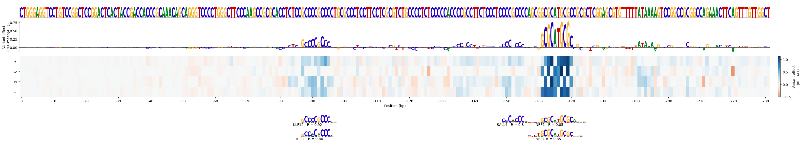

## Table of contents

- [Table of contents](#table-of-contents)
- [Introduction](#introduction)
- [Installation](#installation)
- [Usage examples](#usage-examples)
  - [Predicting promoter activity](#predicting-promoter-activity)
- [Running _in-silico_ mutagenesis](#running-in-silico-mutagenesis)
- [Plotting results of _in-silico_ mutagenesis](#plotting-results-of-in-silico-mutagenesis)
  - [Training your own PARM model](#training-your-own-parm-model)
  - [Making predictions with your own model](#making-predictions-with-your-own-model)
    - [Considerations for training your model](#considerations-for-training-your-model)

## Introduction

PARM (Promoter Activity Regulatory Model) is a deep learning model that predicts the promoter activity from the DNA sequence itself.
As a convolution neural network trained on MPRA data, **PARM** is very lightweight and produces predictions in a cell-type-specific manner.

With the `PARM predict` tool, you can get predictions for any sequence that you want for K562, HepG2, MCF7, LNCaP, or HCT116 cells. 

With `PARM mutagenesis`, in addition to simple promoter activity scores, **PARM** can also produce the so-called _in-silico_ mutagenesis plot.
This is useful for predicting which TFs are regulating (activating or repressing) your sequence. (read more on [Running _in-silico_ mutagenesis](#running-in-silico-mutagenesis)).

## Installation

**PARM** can be easily installed with `conda`:

```sh
conda install -c anaconda -c conda-forge -c bioconda -c pytorch parm
```

## Usage examples

### Predicting promoter activity

To predict the promoter activity in K562 of every sequence in a fasta file, run:

```sh
parm predict \
  --input example_data/input.fasta \
  --output output_K562.txt \
  --model pre_trained_models/K562/
```

> Note that you should replace `pre_trained_models/K562/` with the actual path to the pre-trained models available on this page.
> Also, note that a PARM model is composed of five different folds, as each model is trained five times. If you check the content of `pre_trained_models/K562/`,
> you will see the `.parm` files there, one for each fold. Do not rename or change the files there unless you know what you are doing.

The output is a tab-separated file. 
The first and second columns contain information about the sequence (the sequence and its header).
The following column contains the predicted promoter activity for the model you have selected.

For the command line above, you should expect the following result:

| sequence    | header                           | prediction_K562   |
|-------------|----------------------------------|-------------------|
| CTGGGAGG... | CXCR4_chr2:136875708:136875939:- | 2.287095785140991 |
| GCAACTAA... | MED16_chr19:893131:893362:-      | 2.22406268119812  |
| ACGCCCAG... | TERT_chr5:1295135:1295366:-      | 1.993780255317688 |


## Running _in-silico_ mutagenesis

To compute the _in-silico_ mutagenesis for every sequence in a fasta file, run:

```sh
parm mutagenesis \
  --input example_data/input.fasta \
  --output in_silico_mutagenesis_K562 \
  --model pre_trained_models/K562/
```

For every sequence in the input fasta, **PARM** will predict the effect of every possible mutation of every single base pair.
This result is stored as a matrix, where every row is a nucleotide of the original sequence and the columns are A, C, G, and T; the values in the matrix are the predicted mutation effect.
**PARM** uses the mutagenesis matrix to scan for known transcription factor (TF) binding sites. 
(As default, **PARM** uses the core human database from HOCOOMOCOv11 as the motif dataset, which can be changed with the `--motif_database` parameter.)

The output of `PARM mutagenesis` is a directory where, for every sequence, both the mutagenesis matrix (`mutagenesis_*.txt.gz`) and the scanned TF motifs (`hits_*txt.gz`) are stored.

## Plotting results of _in-silico_ mutagenesis

Results of _in-silico_ mutagenesis are more insightful when visualized in the following format:

<p align="center"></p>

You can easily see the mutagenesis matrix and all the scanned TF motifs.

To produce such a visualization, you can run:

```sh
parm plot \
  --input in_silico_mutagenesis_K562/CXCR4_chr2:136875708:136875939:-/
```

This will read the mutagenesis matrix and the hits for the sequence `sequence_of_interest` and generate the plot.
By default, **PARM** stored the result plot as a PDF inside the input dir.
This can be changed using optional arguments. 

Run `parm plot --help` for additional help on that.

### Training your own PARM model

If you want to train a PARM model with your MPRA data, you must pre-process the raw MPRA counts using our [pre-processing pipeline](https://github.com/vansteensellab/PARM_preprocessing_pipeline).
This will produce, mainly, one-hot encoded files with the promoter activity per fragment, per cell. 
In the `example_data/training_data` directory, we provide an example of this for the AGS and HAP1 cells.

We always train PARM models five independent times, using different folds (splits of the data) for validation.  
To train the PARM models for the AGS cell, you can run:

```sh
# Fold 0 model
parm train \
  --input example_data/training_data/onehot/fold[1234].* \
  --validation example_data/training_data/onehot/fold0.hdf5 \
  --output AGS_fold0 \
  --cell_type AGS
```

This will create the `AGS_fold0` folder, with the following structure:

```
AGS_fold0/
├── AGS_fold0.parm
├── performance_stats/
|   ├── loss_per_epoch.png
|   ├── loss_per_epoch.txt
│   ├── validation_scatter_0.svg
│   ├── validation_scatter_1.svg
│   |-- ...one per epoch
│   └── validation_scatter_6.svg
└── temp_models/ 
    ├── model_epoch_0.pth
    ├── model_epoch_1.pth
    |-- ...one per epoch
    └── model_epoch_6.pth
```

In this case, `AGS_fold0.parm` is the main result.
In the `performance_stats` dir, you will find the training and validation loss of each training epoch ( `loss_per_epoch.*` files), as well as the scatter plot of the measured vs. predicted Log2RPM values for each epoch (`validation_scatter_*.svg` files).
In the `temp_models` dir, you can find the intermediate models for each training epoch (`temp_models` dir).

Similarly, for the other folds, you can run:

```sh
# Fold 1 model
parm train \
  --input example_data/training_data/onehot/fold[0234].* \
  --validation example_data/training_data/onehot/fold1.hdf5 \
  --output AGS_fold1 \
  --cell_type AGS

# Fold 2 model
parm train \
  --input example_data/training_data/onehot/fold[0134].* \
  --validation example_data/training_data/onehot/fold2.hdf5 \
  --output AGS_fold2 \
  --cell_type AGS

# Fold 3 model
parm train \
  --input example_data/training_data/onehot/fold[0124].* \
  --validation example_data/training_data/onehot/fold3.hdf5 \
  --output AGS_fold3 \
  --cell_type AGS

# Fold 4 model
parm train \
  --input example_data/training_data/onehot/fold[0123].* \
  --validation example_data/training_data/onehot/fold4.hdf5 \
  --output AGS_fold4 \
  --cell_type AGS
```

### Making predictions with your own model

After training all the folds, you should place all the folds in a single directory:

```sh
mkdir my_AGS_model
cp AGS_fold0/AGS_fold0.parm \
   AGS_fold1/AGS_fold1.parm \
   AGS_fold2/AGS_fold2.parm \
   AGS_fold3/AGS_fold3.parm \
   AGS_fold4/AGS_fold4.parm \
   my_AGS_model/
```

and then, run:

```sh
parm predict \
  --input example_data/input.fasta \
  --output output_my_AGS.txt \
  --model my_AGS_model/
```

#### Considerations for training your model

- The provided data in the `example_data/training_data` is not enough to train a good PARM model. We only provide it here for the sake of this tutorial.
- Always run the `PARM train` function from a GPU server. A normal CPU machine will take a long time to train a model, even the provided example data. In the start of the training, PARM will print in the screen if a GPU is detected. Make sure that you see `GPU detected? True`.
- Even if your input data contains measurements for more than one cell (as the provided example, that contains data for AGS and HAP1), you can only train a model for one cell at a time.
